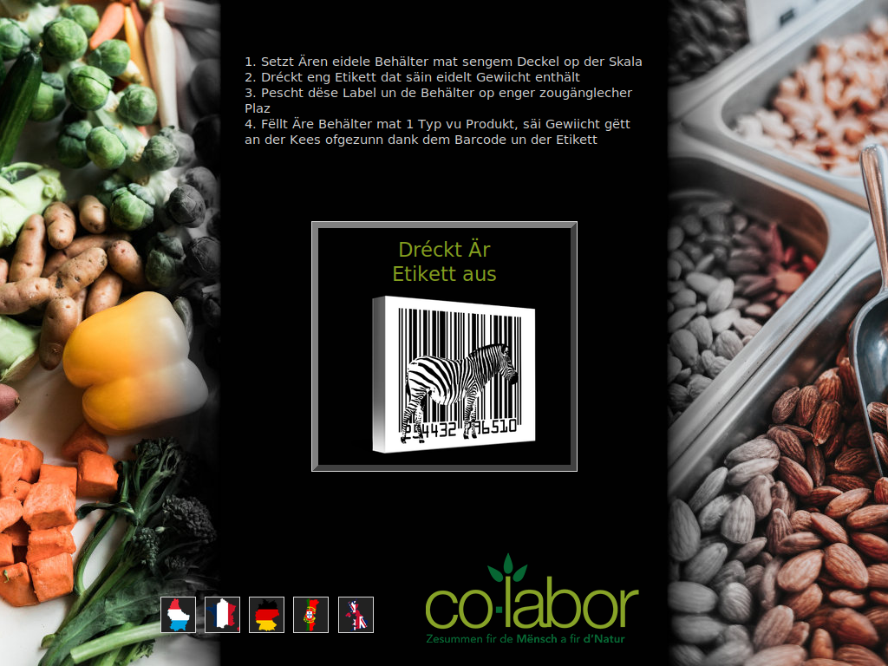

# Scale and Print label - loose goods tare

Point-of-Sales to "weight-it-yourself" and print the Tare of (empty) containers on a barcode label.

The said barcode, glued to the container, can be used in loose goods shops to deduce the Tare from the product weight.

The (default) EAN-13 barcode is compatible with [Odoo module: Point Of Sale - Tare](https://odoo-community.org/shop/point-of-sale-tare-5489?category=15#attr=8466), but mostly all formats are easy to adapt (incl. QR code).

Tested with Zebra label printers (via USB) and Soehnle (Pro) scales (via COM interface)... but plenty flexible. Multilangue interface supports EN, DE, FR, PT, LU.

Tested in Xubuntu, should work in other OS (including windows provided you install Python and CUPS) with minimal changes to config file. Use at your own risks, we're happy so far.

GUI is ready for dual (above) or single (below) setup:

# install

1. download [code](https://github.com/berteh/print-weight-barcodes/archive/refs/heads/main.zip) and unzip (eg to ~/print-weight-barcodes)    
2. edit `config.yaml` to suit your devices
2. install dependencies:

        sudo apt-get install cutecom cups python3-pip python3-tk python3-pil python3-pil.imagetk
        pip install pyserial pycups pyttk pyyaml pytest

3. quick check configuration for most probable errors (configuration, access rights): `pytest`
4. run `cd ~/print-weight-barcodes && python3 gui.py`
5. copy launcher to desktop and *update it's working directory* (right clic > edit launcher) to match your script location

        cp ubuntu/'Tare Kiosk.desktop' $HOME/Desktop/

Current user needs to have rights to read scale weight. add him to `dialout` and `tty` groups.

    sudo gpasswd --add $USER dialout
    sudo gpasswd --add $USER tty

# label editor

Adapt the provided label templates to your need, eg with help of 

- ZPL online editor/viewer at http://labelary.com/viewer.html
- ZPL Syntax reference http://labelary.com/zpl.html
- [ZPL Quick Reference](https://gist.github.com/metafloor/773bc61480d1d05a976184d45099ef56)

# Kiosk mode

Instead of running the app manually, you can keep the app running via a custom systemd service (adapted from https://superuser.com/a/1128905)

Either use the provided script that will configure a user-service and start it on login (in Xubuntu): 

    ./install_as_user_service.sh

Or do it manually for a finer understanding :

- edit script-dir in TareKiosk.service to match your script location
- cp TareKiosk.service $HOME/.config/systemd/user/TareKiosk.service
- systemctl --user daemon-reload
- systemctl --user enable TareKiosk.service

and install applications shortcuts on desktop:

    cp ubuntu/S*.desktop $HOME/Desktop

and service startup at session login:

    cp ubuntu/'Start Tare Kiosk.desktop' $HOME/.config/autostart/

You can then see service status at

    systemctl --user status TareKiosk.service 

start/stop service at

    systemctl --user stop TareKiosk.service
    systemctl --user start TareKiosk.service

# detailed Kiosk install

If you'd like to configure a whole screen-touch Xubuntu system from scratch to run this script you may be interested in the full detailed instructions in [installation station de tare](ubuntu/installation%20station%20de%20tare.md) (french only).

# support and contributions

This code is brought to you for Free by [co-labor](https://co-labor.lu). It's likely no support will be provided as it's not our job, but you can always try opening an [Issue](https://github.com/berteh/print-weight-barcodes/issues).

Improvements are welcome as [Pull-Requests](https://github.com/berteh/print-weight-barcodes/pulls).

